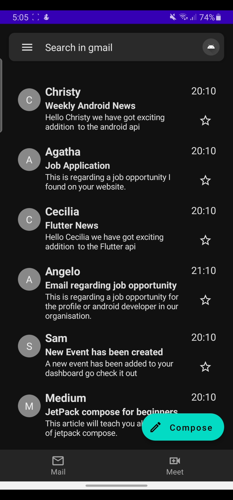
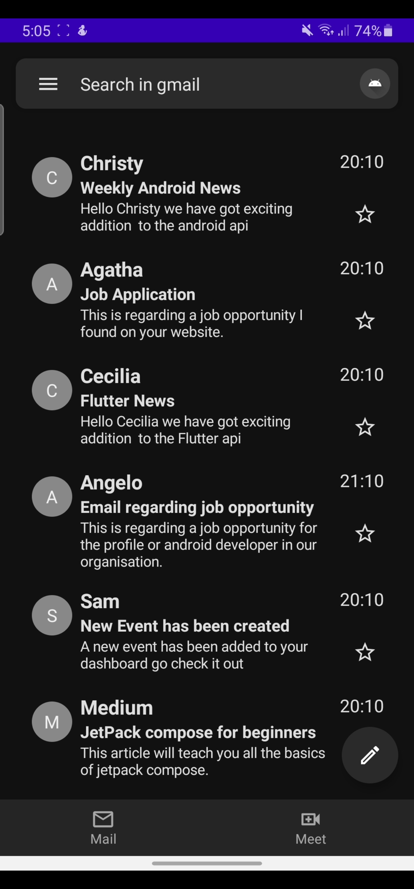
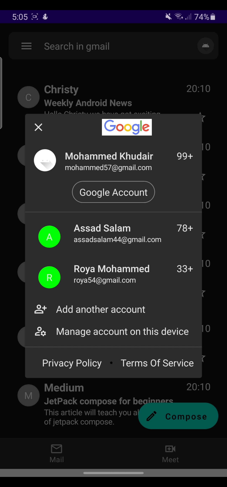
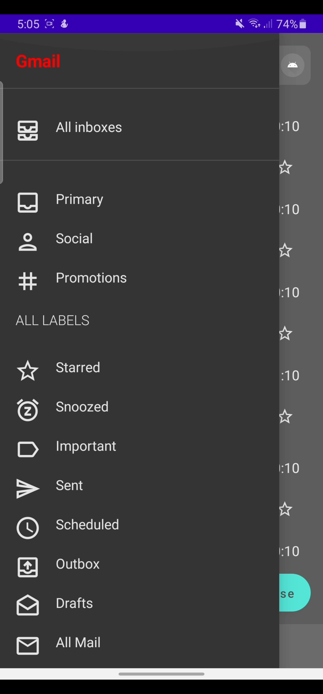

# Gmail UI Clone – Android Development

A visually accurate clone of the Gmail mobile app interface, built using Kotlin and Jetpack Compose. This project is UI-focused and aims to demonstrate modern Android UI design, theming, and layout techniques.

---

## ✨ Features

- **Gmail-inspired UI**: Replicates Gmail's inbox, navigation drawer, and bottom bar
- **Navigation Drawer**: Sections like All Inboxes, Primary, Social, Promotions, Sent, Starred, etc.
- **Top App Bar**: Menu button, search bar, and user profile with account dialog
- **Mail List**: Scrollable list of emails, each showing sender, subject, snippet, timestamp, and star icon
- **Floating Action Button**: Extended FAB for composing mails, dynamically styled
- **Account Dialog**: Modal with user accounts and switching actions
- **Responsive Layouts**: Adaptive for different screen sizes
- **Theming**: Light and dark mode support with custom color palettes
- **Mock Data**: Pre-filled mails and accounts for UI demonstration

---

## 🛠️ Tech Stack

- **Language**: Kotlin
- **UI Toolkit**: Jetpack Compose
- **Architecture**: Single-activity, Compose-based
- **Material Components**: Scaffold, AppBar, Drawer, FAB, Cards, Icons, etc.
- **State Management**: Compose state APIs (`remember`, `mutableStateOf`)
- **Theming**: Compose MaterialTheme with custom palettes
- **No Backend**: UI-only, mock data

---

## 📸 Screenshots


| Inbox View                  | Navigation Drawer             | Compose Button                 |
|-----------------------------|------------------------------|-------------------------------|
|  |  |  |

 <p align="center">
  
    
    
    
</p>

---

## 🚀 Getting Started

1. Clone the repo:
   ```bash
   git clone https://github.com/MohammedKhudair/Gmail-Clone.git
   ```
2. Open in **Android Studio** (Arctic Fox or newer)
3. Run on an emulator or device

---

## 🤝 Contributing

Feel free to fork this repo, submit issues, or make a pull request!

---

## 📄 License

This project is for educational purposes and is not affiliated with Google or Gmail.
